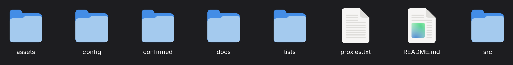
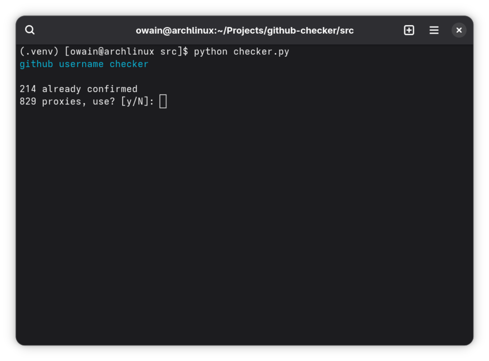
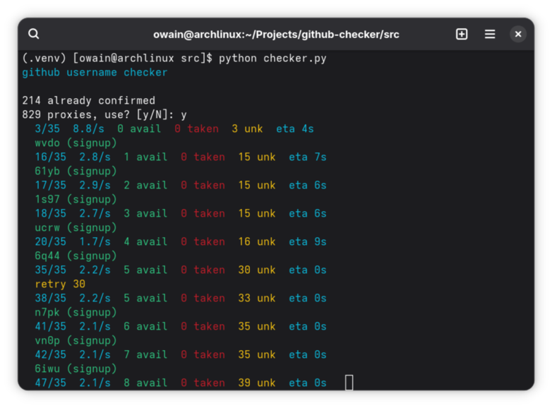
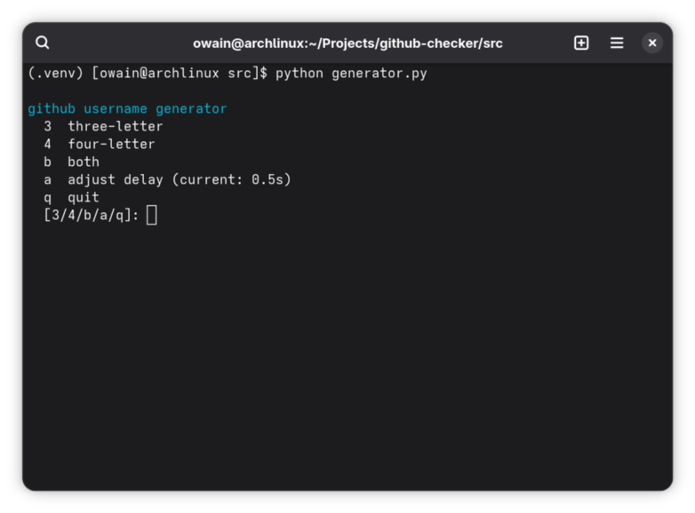
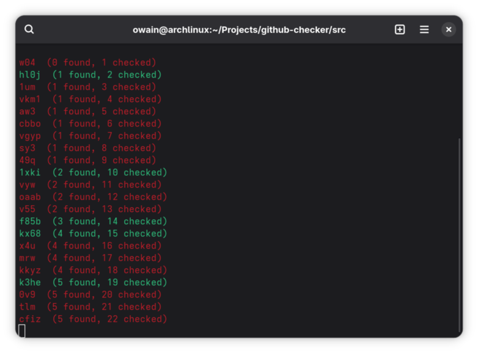

# gh-name-check

[](https://github.com/epwv/gh-name-check)
[](https://github.com/epwv/gh-name-check)
[](https://github.com/epwv/gh-name-check)

checks github username availability by hitting github's signup endpoint directly. no api token needed.
includes generated username lists (`lists/`) and confirmed available names (`confirmed/`). because im cool.

this code is bad, buggy, and slightly vibecoded. it works (sometimes).
original by **Kai Zhao**, butchered and extended by **epwv** with minor help from **opencode** (yes opencode, who on earth uses that, am i right?).

you need your own proxies. find free ones or use your own.

! before we start, here's what the program looks like etc in depth:



*this is what your cloned repo should look like*

## Scripts

### checker.py
batch-checks usernames from text files. turbo async — fires hundreds of requests at once using aiohttp.
- reads from `lists/`, writes available names to `confirmed/`
- tracks progress with live counter
- picks a random proxy from your list for each request
- handles 429/403 with 5-10s backoff retry
- ctrl+c prints a summary of checked/available/failed before exiting


*checker asking about proxy usage on startup*


*checker batch-verifying usernames with live progress*

### generator.py
generates random usernames and checks them on the fly.
- follows configurable patterns (default: letter + 4 numbers)
- checks each name immediately via the signup endpoint
- saves available names to `lists/3_letter_usernames.txt` or `lists/4_letter_usernames.txt`
- adjustable delay between requests (menu option `a`)
- speed menu: `a` to adjust delay, `f` to finish
- ctrl+c prints a summary


*generator landing screen with options*


*generator creating and checking usernames live*

## First Run

both scripts launch an interactive setup if `config/config.json` doesnt exist:
- paste your github token (optional — only used for api fallback)
- set delay between requests (generator only)
- path to proxy list (leave blank for `proxies.txt` in project root)

edit `config/config.json` manually after that:
- `token` — github personal access token (optional)
- `delay` — seconds between requests in generator
- `proxies` — path to proxy file

## Proxy Setup

proxies go in `proxies.txt`, one per line:
```
http://1.2.3.4:3128
http://5.6.7.8:8080
socks5://9.10.11.12:1080
```

no proxies bundled. find free ones or use your own. the checker cycles through them randomly.
without proxies youll get rate-limited fast.

## How It Works

both scripts hit the same endpoint:
```
GET /signup_check_new/username?suggest_usernames=true&value=<username>
```
- **200 response** = username is available
- **422 response** = username is taken

this is the same endpoint github.com uses when you type a username during signup.
no authentication needed — the github token is optional and only used as a fallback if the direct endpoint fails.

## Limitations

- **false positives / false negatives happen.** the endpoint lies sometimes. dont trust it blindly.
- no proxy = instant rate limit. you need a rotating proxy pool.
- github might change the endpoint or add protections at any time.
- the generator patterns are basic — you might want to customize the generation logic.

## Structure

```
github-checker/
├── src/
│   ├── checker.py          batch checker
│   └── generator.py        username generator & verifier
├── config/
│   └── config.json         settings (token, delay, proxies)
├── docs/
│   └── Home.md             documentation
├── .github/
│   ├── 404.md              custom 404 page
│   └── profile.png         social preview image
├── assets/
│   ├── preview.png          repo structure screenshot
│   ├── checker-proxy-prompt.png
│   ├── checker-running.png
│   ├── generator-menu.png
│   └── generator-running.png
├── lists/
│   ├── 3_letter_usernames.txt
│   └── 4_letter_usernames.txt
├── confirmed/
│   └── available_confirmed.txt
├── proxies.txt             your proxy list (one per line)
└── README.md
```


