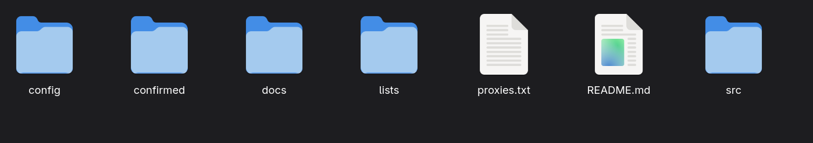
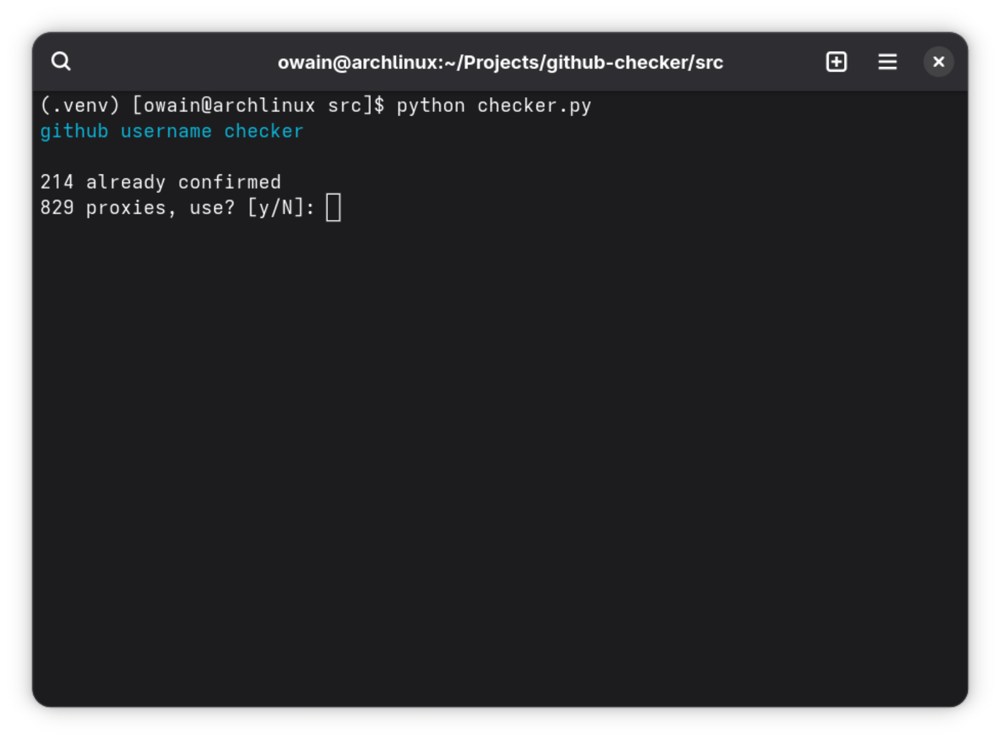
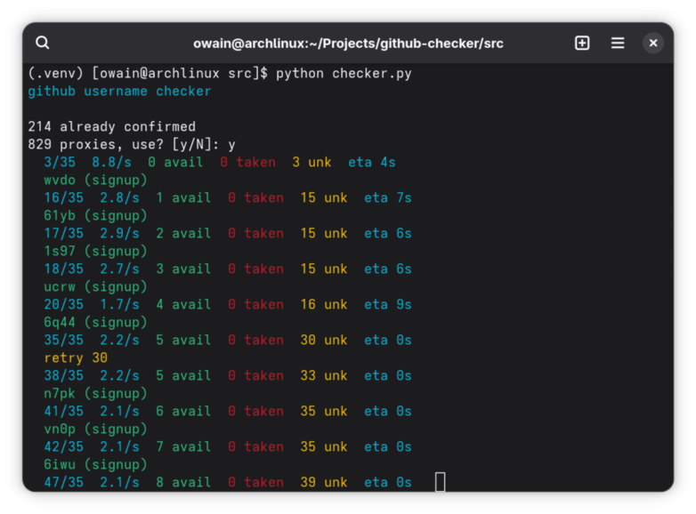
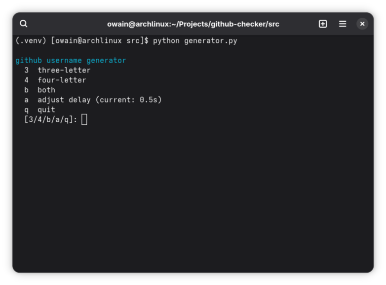
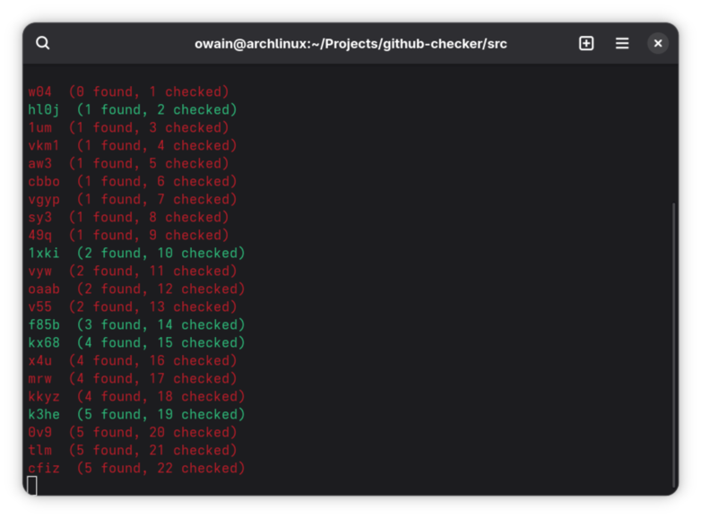

# gh-name-check

[](https://github.com/epwv/gh-name-check)
[](https://github.com/epwv/gh-name-check)
[](https://github.com/epwv/gh-name-check)

A GitHub username availability checker and generator. It queries GitHub's signup endpoint directly, so no API token is required.

Includes generated username lists (`lists/`) and confirmed available names (`confirmed/`).

Proxies are required for sustained use and are not bundled — bring your own.



*Repository layout after cloning.*

## Scripts

### checker.py

Batch-checks usernames from text files. Uses asyncio and aiohttp to fire many concurrent requests.

- Reads from `lists/`, writes available names to `confirmed/`
- Live progress counter (rate, ETA, available/taken/unknown)
- Rotates through a proxy list, one random proxy per request
- Handles HTTP 429/403 with exponential backoff (up to 3 retries), and drops concurrency automatically when no proxies are in use
- Ctrl+C prints a summary of checked/available/failed before exiting



*Proxy usage prompt on startup.*



*Batch verification with live progress.*

### generator.py

Generates random usernames and checks them as it goes.

- Follows a configurable pattern (default: 3- or 4-character alphanumeric strings)
- Checks each name immediately via the signup endpoint
- Saves available names to `lists/3_letter_usernames.txt` or `lists/4_letter_usernames.txt`
- Adjustable delay between requests (menu option `a`)
- `q` to quit
- Ctrl+C prints a summary



*Landing menu.*



*Generating and checking usernames live.*

## First Run

Both scripts launch an interactive setup wizard if `config/config.json` doesn't exist:

- GitHub token (optional — used only as an API fallback)
- Delay between requests (generator only)
- Path to a proxy list (leave blank to default to `proxies.txt` in the project root)

`config/config.json` can also be edited manually afterward:

| Key | Description |
|---|---|
| `token` | GitHub personal access token (optional) |
| `delay` | Seconds between requests in the generator |
| `proxies` | Path to the proxy file |

## Proxy Setup

List one proxy per line in `proxies.txt`:

```
http://1.2.3.4:3128
http://5.6.7.8:8080
socks5://9.10.11.12:1080
```

No proxies are bundled — supply your own. The checker selects one at random per request. Without proxies, expect to be rate-limited quickly.

## How It Works

Both scripts call the same endpoint GitHub's website uses during signup:

```
GET /signup_check_new/username?suggest_usernames=true&value=<username>
```

- **200** — username is available
- **422** — username is taken

No authentication is required. A GitHub token is optional and used only as a fallback if the direct endpoint fails.

## Limitations

- **False positives and false negatives happen.** The endpoint's behavior isn't guaranteed — don't trust it blindly.
- Without a proxy pool, expect near-instant rate limiting.
- GitHub may change or protect this endpoint at any time.
- The generator's naming patterns are basic; customize the generation logic for other formats.

## Structure

```
gh-name-check/
├── src/
│   ├── checker.py           batch checker
│   └── generator.py         username generator and verifier
├── config/
│   └── config.json          settings (token, delay, proxies)
├── docs/
│   └── Home.md               documentation
├── .github/
│   ├── 404.md                custom 404 page
│   └── profile.png           social preview image
├── assets/
│   ├── preview.png           repository structure screenshot
│   ├── checker-proxy-prompt.png
│   ├── checker-running.png
│   ├── generator-menu.png
│   └── generator-running.png
├── lists/
│   ├── 3_letter_usernames.txt
│   └── 4_letter_usernames.txt
├── confirmed/
│   └── available_confirmed.txt
├── proxies.txt                your proxy list (one per line)
└── README.md
```

Original concept by **Kai Zhao**.
